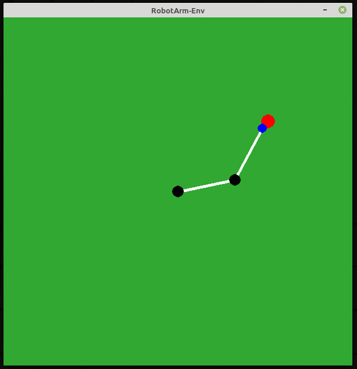

# OpenAI Gym 2D Robot Arm Environment

**Description**

This is a OpenAI gym environment for two links robot arm in 2D based on PyGame.



The robot consist of two links that each links has 100 pixels length, and the goal is reaching red point that generated randomly every episode. 
The observation space is continuous that consist of:

* target position in x direction (in pixels)
* target position in y direction (in pixels)
* current joint 1 position (in radians)
* current joint 2 position (in radians)

The action space is discrete that consist of:

* 0: Increment joint 1
* 1: Decrement joint 1
* 2: Hold joint 1
* 3: Increment joint 2
* 4: Decrement joint 2
* 5: Hold joint 2

By default, increment or decrement rate for both of joints are 0.01 radians. 

The reward function of the robot is:

* Robot will got penalty -1 if current distance between tip and target position is smaller than previous distance
* Robot will get reward 1 if cureent distance between tip and target position is > -epsilon and < epsilon, where epsilon = 10 pixels

**How To Install**

```bash
git clone https://github.com/ekorudiawan/gym-robot-arm.git
cd gym-robot-arm
pip install -e .
```

**Dependencies**
* OpenAI Gym
* PyGame
* Scipy

**Testing Environment**

```python
import gym 

env = gym.make('gym_robot_arm:robot-arm-v0')

for i_episode in range(20):
    observation = env.reset()
    for t in range(100):
        env.render()
        print(observation)
        action = env.action_space.sample()
        observation, reward, done, info = env.step(action)
        if done:
            print("Episode finished after {} timesteps".format(t+1))
            break
env.close()

```